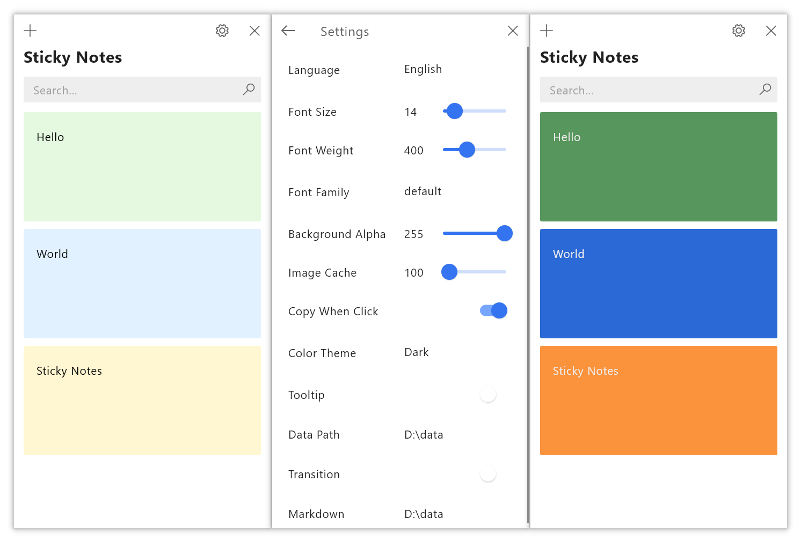
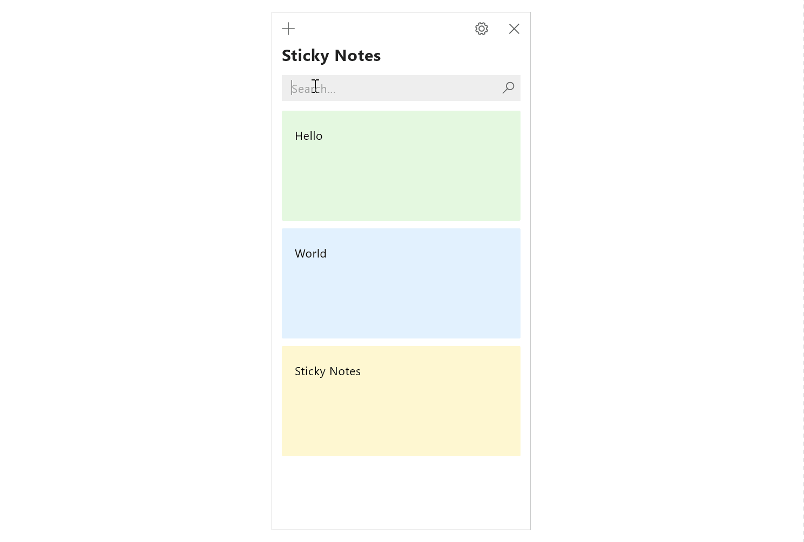
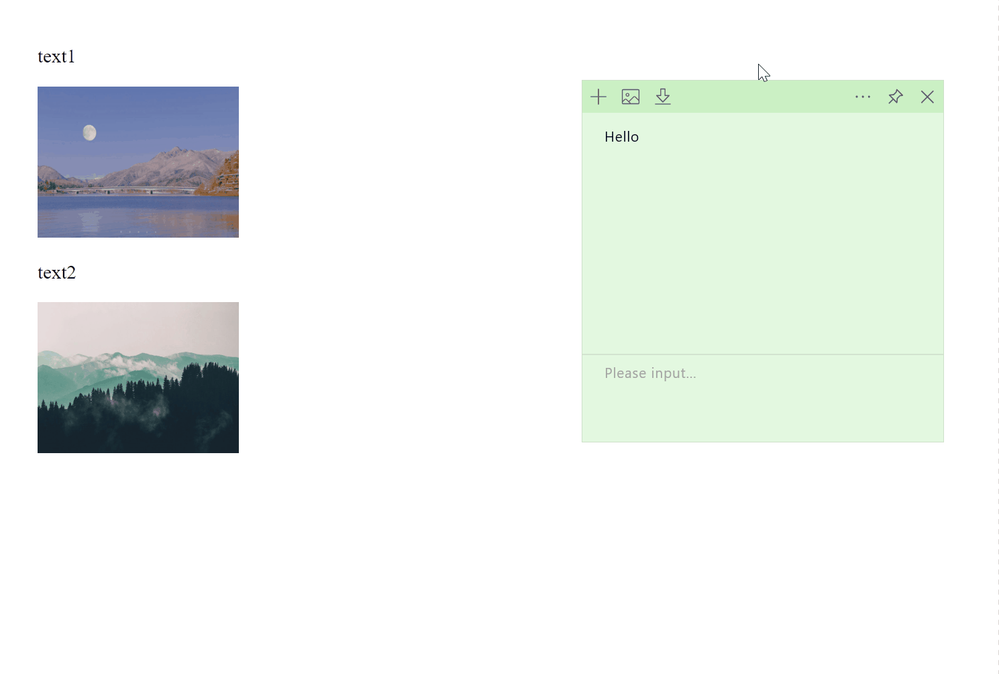

# Sticky Notes

Windows Sticky Notes based on [Compose Multiplatform](https://github.com/JetBrains/compose-multiplatform)

> Java 21+ is required

## Screenshots







## Third-party dependencies

[https://github.com/Calvin-LL/Reorderable](https://github.com/Calvin-LL/Reorderable)

[https://github.com/apache/lucene](https://github.com/apache/lucene)

## Other things

`gradle/wrapper/gradle-wrapper.properties`:

```properties
distributionUrl=https\://mirrors.aliyun.com/macports/distfiles/gradle/gradle-8.7-all.zip
```

`build.gradle.kts`:
```kotlin
maven("https://maven.aliyun.com/repository/public") 
maven("https://maven.aliyun.com/repository/central") 
maven("https://maven.aliyun.com/repository/google")
maven("https://maven.aliyun.com/repository/gradle-plugin")
```